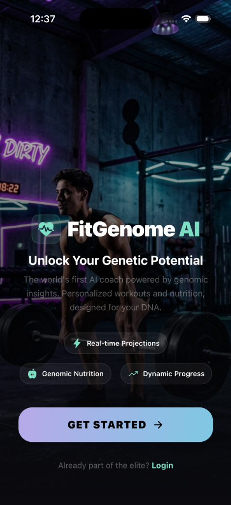
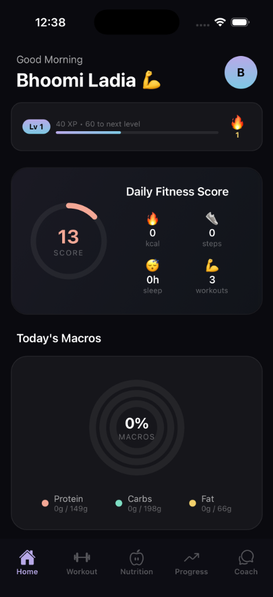
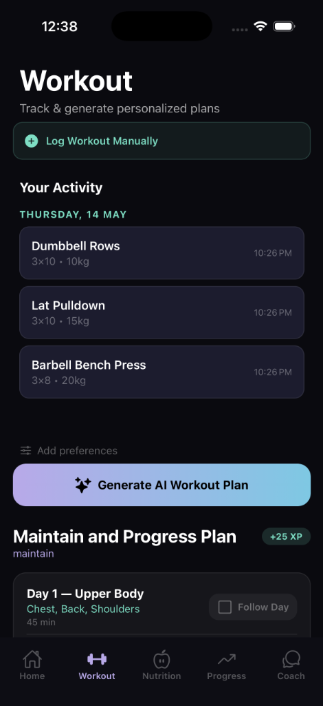
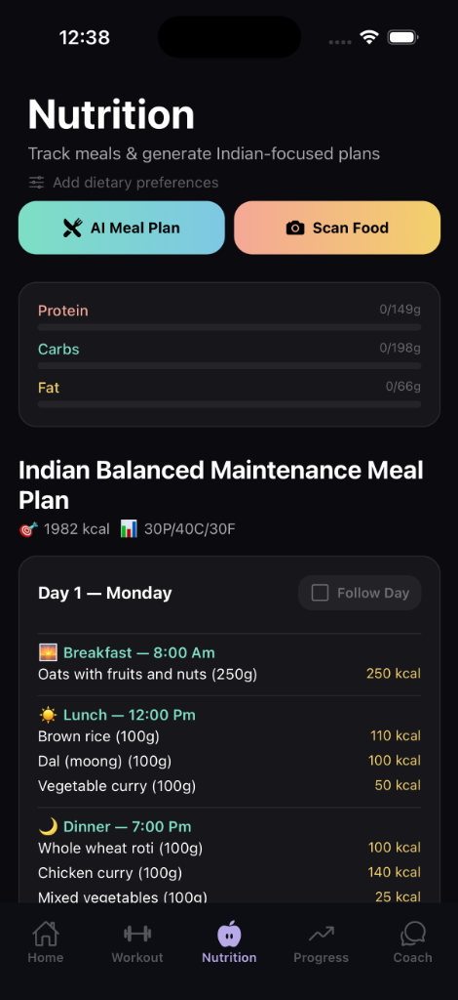
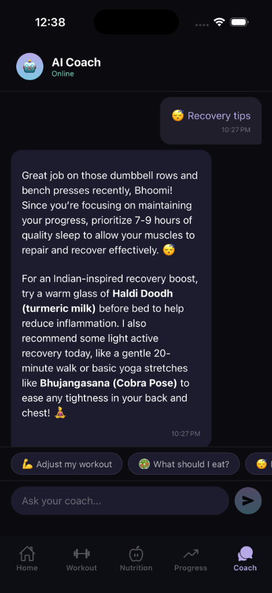
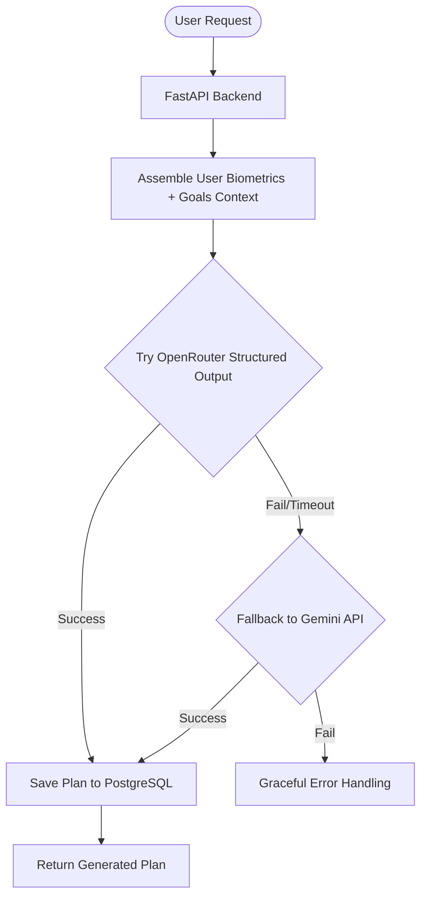
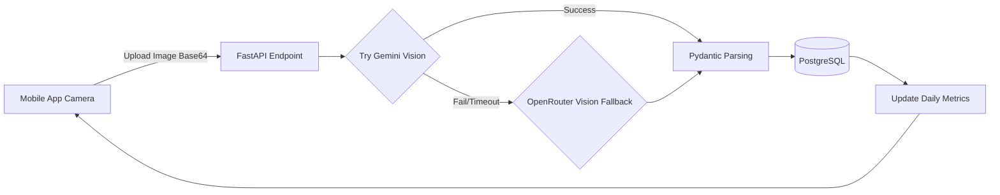

# FitGenome AI

FitGenome AI is a premium, AI-first fitness ecosystem that combines robust backend orchestration with a sleek React Native mobile experience. Utilizing an intelligent LLM fallback chain powered by OpenRouter and direct Gemini APIs, manual PostgreSQL queries via `asyncpg`, and visually stunning gamification elements, FitGenome provides users with hyper-personalized workout plans, real-time nutritional scanning, and a conversational AI coach.

---

## Screenshots

| Landing Page | Home Dashboard | Workout Plans | Nutrition Tracking | AI Coach |
|:---:|:---:|:---:|:---:|:---:|
|  |  |  |  |  |

---

## Features

- **Multi-Provider AI Orchestration:** Employs an intelligent fallback chain (`OpenRouter -> Gemini`) ensuring 99.9% uptime for AI generation. If one provider fails or returns poorly formatted structured output, the system seamlessly attempts the next.
- **Manual PostgreSQL (asyncpg):** Direct, blazing-fast raw SQL interaction using a custom managed `asyncpg` connection pool.
- **Computer Vision Macro Tracking:** Utilizes vision models (Gemini Vision with OpenRouter fallback) to instantly analyze meals from photos, estimating calories, protein, carbs, and fats.
- **Gamified Fitness Journey:** Tracks workout consistency through a streak and leveling system. Users earn XP for logging workouts and maintaining streaks.
- **Context-Aware AI Coach:** A chat interface that remembers your goals, TDEE, weight, recent workout logs, and previous conversational history to give highly contextual advice.
- **Premium Mobile Experience:** Built with Expo and React Native, featuring dark mode aesthetics, glassmorphism UI, gradient overlays, and fully rendering Markdown chat responses.
- **Interactive Glassmorphic Profile Manager:** Tap the home screen avatar to open a beautiful glassmorphic biometrics and settings dashboard. Features instant TDEE/BMR dynamic calculations, biological range validation, a horizontal blood group picker, and multiple selector chips for activity level, gender, and fitness goal. Includes safe sign-out confirmation.

---
## System Architecture

### Orchestrator Fallback Flow


### Vision Scanning Pipeline


---


## Getting Started

### 1. Prerequisites
- Docker & Docker Compose
- Node.js (v18+)
- Python 3.11+
- API Keys: `OPENROUTER_API_KEY`, `GEMINI_API_KEY`

### 2. Backend Setup (Docker)

Clone the repository and set up your environment variables:
```bash
cp .env.example .env
# Edit .env and add your respective API keys
```

Spin up the entire backend stack (FastAPI, PostgreSQL):
```bash
docker-compose up --build
```
*The backend API will be available at `http://localhost:8000` with interactive Swagger docs at `/docs`.*

### 3. Mobile App Setup (Expo)

Navigate to the mobile directory and install dependencies:
```bash
cd mobile
npm install
```

Start the Metro bundler:
```bash
npx expo start -c
```
*Scan the QR code with the Expo Go app on your physical device, or press `i` to launch the iOS simulator.*

---

### 4. Database Maintenance & Cleanup

To keep the database performing optimally, FitGenome AI provides a robust cleanup utility to identify and safely purge incomplete user profiles (profiles that are not fully onboarded or are missing critical biometrics like age, gender, height, and weight).

Because the database schema implements cascading deletes (`ON DELETE CASCADE`), running this utility will safely and cleanly purge all orphaned child records (workout logs, nutrition logs, daily metrics, streaks, personas, plans, and chat messages) linked to these incomplete profiles.

To run the cleanup utility:

**Inside the Docker container (Recommended):**
```bash
docker exec -it fitgenome-api python scripts/cleanup_db.py
```

**To run automatically (e.g., in a cron job or deployment pipeline):**
```bash
docker exec -i fitgenome-api python scripts/cleanup_db.py --auto
```

---

## Core Directory Structure

```text
FitGenome_AI/
├── app/
│   ├── api/routes/         # FastAPI endpoints (auth, chat, ai, biometrics, logs, admin)
│   ├── core/               # App configuration, security, and LLM factories
│   ├── db/                 # Database initialization and connection pool management
│   ├── models/             # Pydantic schemas/models
│   ├── schemas/            # Pydantic schemas for request/response validation
│   └── services/           # Business logic (AIOrchestrator, Vision, Gamification)
├── mobile/
│   ├── app/                # Expo Router file-based navigation
│   │   ├── (auth)/         # Login, Register, Onboarding flows
│   │   └── (tabs)/         # Dashboard, Coach, Nutrition, Workouts
│   ├── components/         # Reusable React Native UI elements
│   ├── constants/          # Theme colors, typography, and spacing
│   └── hooks/              # Custom React Query data fetching hooks
├── scripts/
│   └── cleanup_db.py       # Database profile cleanup utility
├── schema.sql              # Raw PostgreSQL schema definition
├── docker-compose.yml      # Infrastructure orchestration
└── requirements.txt        # Python dependencies
```

---

## Tech Stack

**Backend:**
- Python 3.11, FastAPI, raw PostgreSQL (`asyncpg`)
- OpenRouter API, OpenAI SDK, `google-genai` SDK
- Pydantic v2 (Validation & Serialization)

**Mobile:**
- React Native, Expo (SDK 55), Expo Router
- TanStack React Query, Axios
- `react-native-markdown-display` (Markdown parsing)

---
*Built for advanced AI fitness tracking.*
