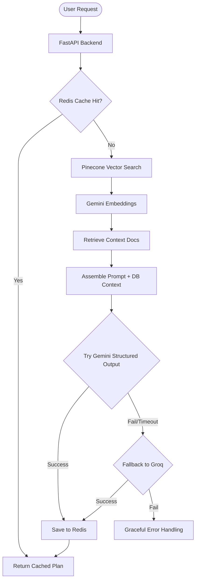
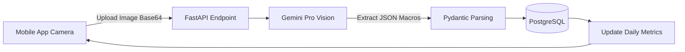

# FitGenome AI

FitGenome AI is a premium, AI-first fitness ecosystem that combines robust backend orchestration with a sleek React Native mobile experience. Utilizing an intelligent LLM fallback chain, Pinecone RAG integrations, and visually stunning gamification elements, FitGenome provides users with hyper-personalized workout plans, real-time nutritional scanning, and a conversational AI coach.

---

## Screenshots

| Landing Page | Home Dashboard | Workout Plans | Nutrition Tracking | AI Coach |
|:---:|:---:|:---:|:---:|:---:|
|  |  |  |  |  |

---

## Features

- **Multi-Provider AI Orchestration:** Employs a fallback chain (`Gemini -> Groq`) ensuring 99.9% uptime for AI generation. If one provider fails or returns poorly formatted structured output, the system seamlessly attempts the next.
- **Pinecone RAG Architecture:** Grounds LLM responses using a Pinecone vector database populated with current peer-reviewed research on progressive overload, hypertrophy, and nutrition.
- **Computer Vision Macro Tracking:** Utilizes vision models to instantly analyze meals from photos, estimating calories, protein, carbs, and fats.
- **Gamified Fitness Journey:** Tracks workout consistency through a streak and leveling system. Users earn XP for logging workouts and maintaining streaks.
- **Context-Aware AI Coach:** A chat interface that remembers your goals, TDEE, weight, recent workout logs, and previous conversational history to give highly contextual advice.
- **Premium Mobile Experience:** Built with Expo and React Native, featuring dark mode aesthetics, glassmorphism UI, gradient overlays, and fully rendering Markdown chat responses.

---

## System Architecture

### Orchestrator Fallback Flow


### Vision Scanning Pipeline


---

## Getting Started

### 1. Prerequisites
- Docker & Docker Compose
- Node.js (v18+)
- Python 3.11+
- API Keys: `GEMINI_API_KEY`, `GROQ_API_KEY`, `PINECONE_API_KEY`

### 2. Backend Setup (Docker)

Clone the repository and set up your environment variables:
```bash
cp .env.example .env
# Edit .env and add your respective API keys
```

Spin up the entire backend stack (FastAPI, PostgreSQL, Redis, Celery):
```bash
docker-compose up --build
```
*The backend API will be available at `http://localhost:8000` with interactive Swagger docs at `/docs`.*

### 3. Mobile App Setup (Expo)

Navigate to the mobile directory and install dependencies:
```bash
cd mobile
npm install
```

Start the Metro bundler:
```bash
npx expo start -c
```
*Scan the QR code with the Expo Go app on your physical device, or press `i` to launch the iOS simulator.*

---

## Core Directory Structure

```text
FitGenome_AI/
├── app/
│   ├── api/routes/         # FastAPI endpoints (auth, chat, ai, biometrics)
│   ├── core/               # App configuration, security, and LLM factories
│   ├── models/             # SQLAlchemy ORM models
│   ├── schemas/            # Pydantic schemas for request/response validation
│   └── services/           # Business logic (AIOrchestrator, Pinecone, Vision)
├── mobile/
│   ├── app/                # Expo Router file-based navigation
│   │   ├── (auth)/         # Login, Register, Onboarding flows
│   │   └── (tabs)/         # Dashboard, Coach, Nutrition, Workouts
│   ├── components/         # Reusable React Native UI elements
│   ├── constants/          # Theme colors, typography, and spacing
│   └── hooks/              # Custom React Query data fetching hooks
├── data/knowledge/         # Markdown research documents for RAG embedding
├── docker-compose.yml      # Infrastructure orchestration
└── requirements.txt        # Python dependencies
```

---

## Tech Stack

**Backend:**
- Python 3.11, FastAPI, SQLAlchemy (Async), PostgreSQL, Alembic
- Redis, Celery (Background Processing)
- LangChain, Pinecone (Vector DB), Gemini/Groq (LLMs)

**Mobile:**
- React Native, Expo (SDK 55), Expo Router
- TanStack React Query, Axios
- `react-native-markdown-display` (Markdown parsing)

---
*Built for advanced AI fitness tracking.*
